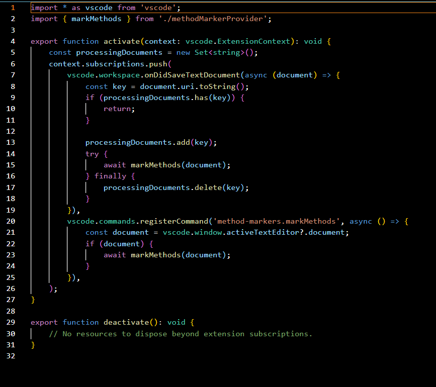
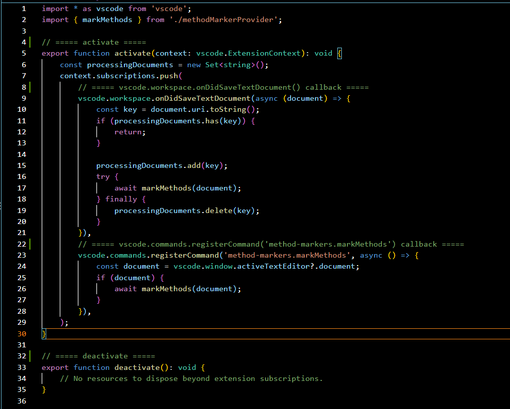

# Method Markers

Method Markers makes source files easier to scan by placing a compact marker directly above every detected function, method, or constructor.

It runs locally inside VS Code. It does not use AI, API keys, external services, or network requests.

## Before and After

Before saving:

```java
public class DocumentService {

    private String name;

    public DocumentService() {
    }

    public void uploadDocument() {
    }

    public void uploadDocument(String path) {
    }
}
```

After saving:

```java
public class DocumentService {

    private String name;

    // ===== DocumentService =====
    public DocumentService() {
    }

    // ===== uploadDocument =====
    public void uploadDocument() {
    }

    // ===== uploadDocument =====
    public void uploadDocument(String path) {
    }
}
```

Python uses `#` markers:

```python
# ===== upload_document =====
def upload_document():
    pass
```

JavaScript and TypeScript use `//` markers:

```javascript
// ===== fetchUser =====
async function fetchUser() {}
```

## Before and After

### Before



### After



## Installation

Download the latest `.vsix` file from the GitHub Releases section of this repository.
###Download the `1.2.0` version


In VS Code:

1. Open Extensions with `Ctrl+Shift+X`.
2. Click the `...` menu.
3. Select **Install from VSIX...**
4. Select the downloaded `.vsix` file.
5. Reload VS Code if prompted.

No Marketplace account or additional service is required.

## Use

### Automatically on Save

Open a supported source file and save it with `Ctrl+S` (or `Cmd+S` on macOS). Method Markers finds callable document symbols, then adds any missing markers.

### Manually

Open the Command Palette with `Ctrl+Shift+P` (or `Cmd+Shift+P` on macOS), then run:

```
Method Markers: Mark Methods
```

The command processes the active editor only.

## Privacy

Method Markers operates entirely inside VS Code.

It does not:

- Use AI
- Send source code anywhere
- Make network requests
- Require API keys
- Connect to external services
- Collect telemetry

Your source code stays on your machine.

## Behavior and Safety

- Supports Java, JavaScript, TypeScript, JavaScript React, TypeScript React, C, C++, C#, Go, Rust, Kotlin, PHP, Python, Ruby, and Shell Script.
- Uses VS Code's built-in document-symbol provider to identify functions, methods, and constructors.
- Uses `//` markers for Java, JavaScript, TypeScript, React variants, C, C++, C#, Go, Rust, Kotlin, and PHP; uses `#` markers for Python, Ruby, and Shell Script.
- Handles multiple functions, overloaded methods, nested symbols, and constructors reported by the language provider.
- Uses a single VS Code `WorkspaceEdit` for all markers found during a run.
- Checks for the expected marker immediately above each declaration before inserting it, including when the Java language provider includes comments in a symbol range.
- Preserves user comments, source code, imports, method names, and formatting. Generated comments inherit the declaration's indentation.
- Does nothing when a supported document has no callable symbols or when the active document uses an unsupported language.
- Never removes existing comments, including markers produced by an earlier version of the extension.

For detection, VS Code needs language support that provides document symbols for the file you are editing. Install and enable the relevant language extension where VS Code does not provide that support itself.

## Run Locally During Development

1. Open this project folder in VS Code.
2. Install dependencies:

   ```bash
   npm install
   ```

3. Press `F5` to start an Extension Development Host.
4. In that new VS Code window, open a supported source file and save it.

## Development Commands

```bash
npm run compile
npm run lint
npm test
```

`npm test` starts a VS Code Extension Development Host and runs the extension test suite.

## Requirements

- VS Code 1.85 or later
- Language support that provides document symbols for the source language being marked

## License

MIT License
